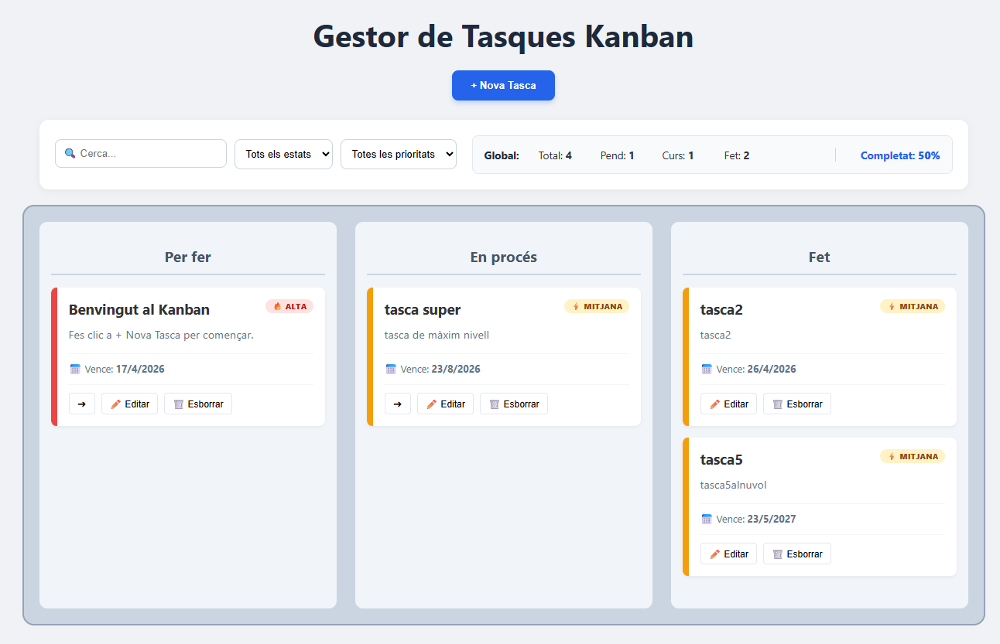
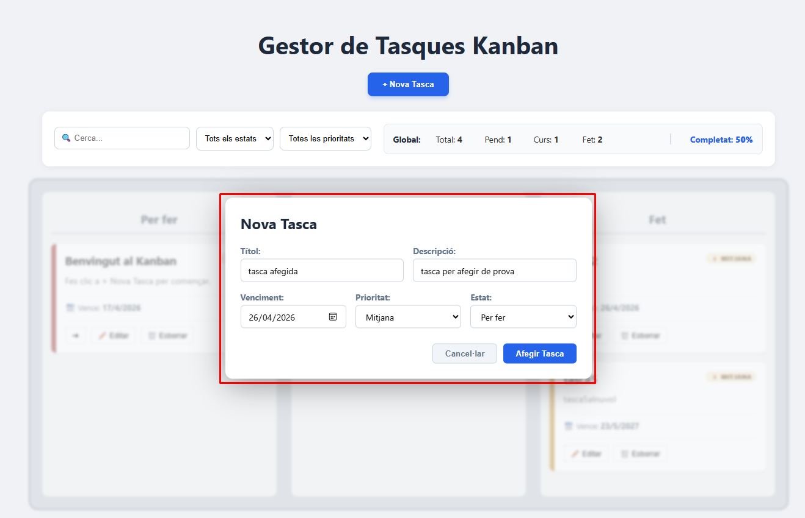
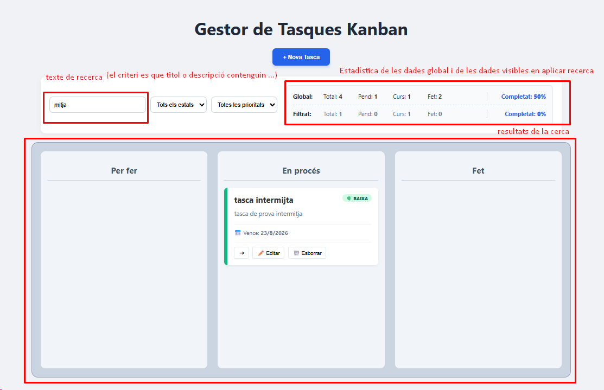
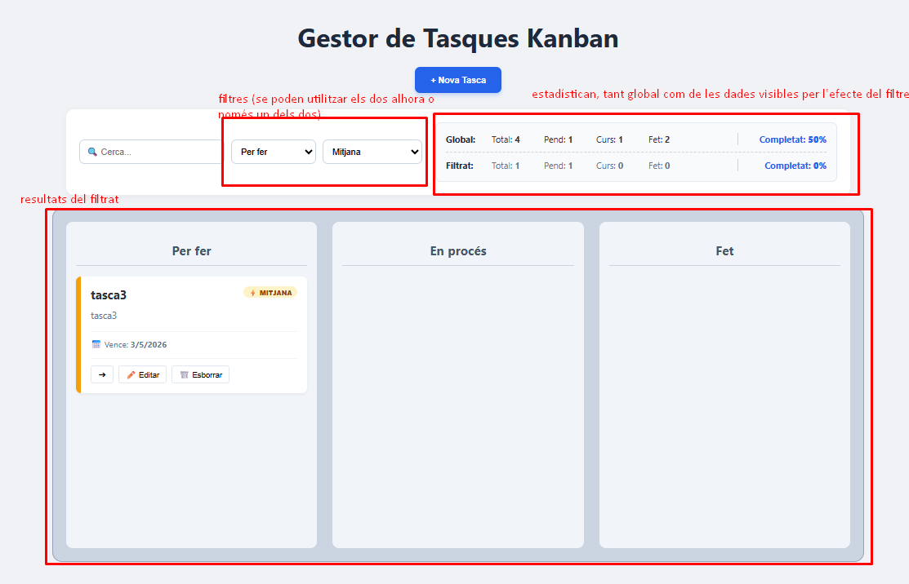
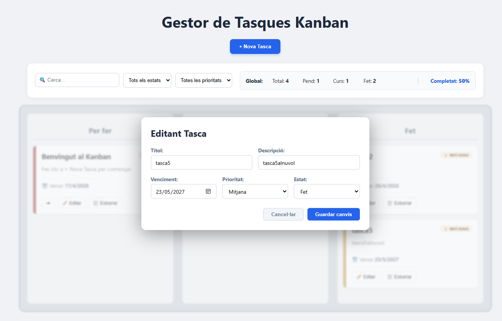
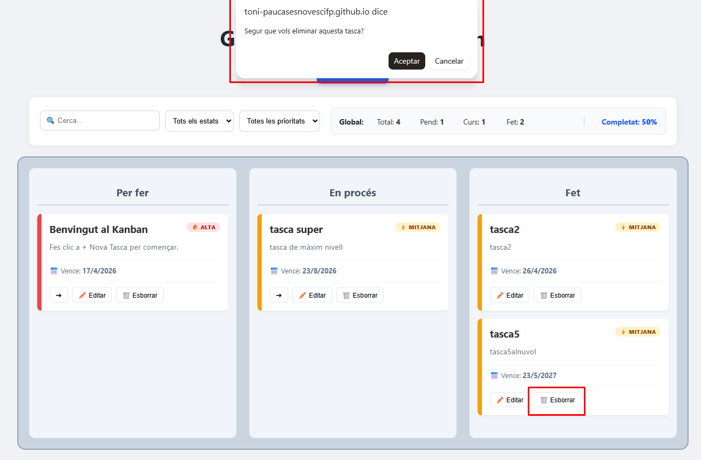

# 📋 Kanban Scrum App

Benvingut al **Gestor de Tasques Kanban**! Una aplicació web interactiva, neta i lleugera dissenyada per gestionar fluxos de treball mitjançant un tauler visual dinàmic. Organitza el teu dia a dia amb control total sobre prioritats i estats.

*   **🚀 Aplicació en viu (GitHub Pages):** [https://toni-paucasesnovescifp.github.io/DAW06/](https://toni-paucasesnovescifp.github.io/DAW06/)
*   **💻 Repositori del codi (GitHub):** [https://github.com/Toni-paucasesnovescifp/DAW06](https://github.com/Toni-paucasesnovescifp/DAW06)

---

## 📸 Guia Visual
*(Clica sobre les imatges per ampliar-les a pantalla completa. Disseny optimitzat per a mòbils)*

### 🖥️ Interfície i Creació

[](img/dashboard.png)
<br>
*1. Vista general del tauler amb columnes i estadístiques.*

[](img/afegir.png)
<br>
*2. Formulari per afegir noves tasques al sistema.*

### 🔍 Recerca i Filtres Avançats

[](img/cerca.png)
<br>
*3. Recerca per text en títol i descripció.*

[](img/filtres.png)
<br>
*4. Sistema de filtratge combinat per prioritat i estat.*

### ✏️ Gestió i Manteniment

[](img/editar.png)
<br>
*5. Edició de tasques existents en temps real.*

[](img/borrar.png)
<br>
*6. Confirmació de seguretat abans d'eliminar.*

---

## 📖 Guia d'Ús

1.  **Crear una tasca:** Prem **"+ Nova Tasca"**, omple les dades i desa. Apareixerà a la columna corresponent a l'instant.
2.  **Organitzar i Moure:**
    *   **Fletxes (➔):** Mou la tasca amb un sol clic a la següent fase.
    *   **Drag & Drop:** Arrossega la targeta físicament entre columnes.
3.  **Editar i Esborrar:** Utilitza l'icona ✏️ per modificar dades o 🗑️ per suprimir de forma definitiva.

### 🕵️ Filtratge Intel·ligent (Fins a 3 criteris)
L'aplicació permet trobar qualsevol tasca combinant aquests mètodes:
*   **Cerca per text:** Escriu al quadre de recerca; el sistema mostrarà les tasques on el **títol** o la **descripció** continguin el text introduït (encara que el text de la tasca sigui més llarg).
*   **Filtres de selecció:** Pots triar una **Prioritat** (Alta, Mitjana, Baixa) i/o un **Estat** (Per fer, En curs, Fet).
*   **Combinació total:** Pots utilitzar el quadre de text, el filtre de prioritat i el filtre d'estat **al mateix temps**. Això permet un filtratge de màxima precisió amb 3 criteris simultanis.

---

## 📥 Instal·lació Local (Pas a pas)

1.  **Descarrega:** Ves al [Repositori oficial](https://github.com/Toni-paucasesnovescifp/DAW06) i baixa el **ZIP** (botó verd "Code").
2.  **Extraure:** Descomprimeix el fitxer `DAW06-main.zip` al teu ordinador.
3.  **Executar:** Fes **doble clic** sobre el fitxer `index.html`. S'obrirà al teu navegador sense necessitat d'instal·lar res ni tenir Internet.

---

## ✨ Característiques Tècniques Destacades

*   **⚡ CRUD en temps real:** Qualsevol operació s'actualitza a l'acte. Les tasques es recol·loquen a la columna corresponent amb el seu format visual (🔥 Roig, ⚡ Ambre, 🍀 Verd) de forma immediata sense recarregar la pàgina.
*   **📱 Disseny Full Responsive:** El README i l'aplicació estan optimitzats per veure's bé en qualsevol pantalla (mòbil, tablet o PC).
*   **💾 Persistència:** Les dades es guarden al `LocalStorage` del navegador perquè no es perdin en tancar la sessió.
*   **📊 Estadístiques Vives:** Els comptadors globals i filtrats es calculen al moment segons els criteris actius (Text + Prioritat + Estat).

---

## 🛠️ Estructura del Projecte

```text
D:\DESPLEGAMENT\DAW06\DAW06
├── index.html        # Estructura i interfície d'usuari
├── README.md         # Aquest manual d'instruccions
├── css/
│   └── estils.css    # Disseny visual i responsive
├── js/
│   └── script.js     # Lògica, filtratge combinat i Drag & Drop
└── img/              # Captures de pantalla de la guia visual
```

---
📅 **2024** | **DAW06 - Desplegament d'Aplicacions Web** | **Autor:** Toni
